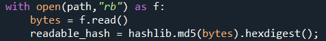
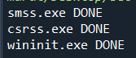
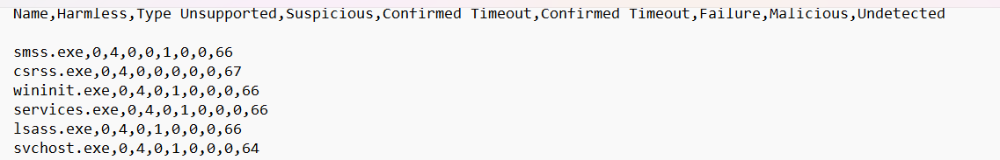

# ViruTotal_Hash_Scan
Scanning all the running .exe files in VirusTotal with Python.

## Necessary Libraries:

*RUN THIS SCRIPT IN C:/ PATH*

| Library  | Code to install |
| ------------- | ------------- |
| hashlib  | ``` pip install hashlib ```  |
| pathlib2  | ``` pip install pathlib2 ```  |
| WMI  |``` pip install WMI ``` |
| requests | ```pip install requests ```|


### Getting .exe files
I used wmi library to get all running files from device. Then saved into a list called "liste".
<br>


||
|---------|
| Libraries |

<br>

### Scanning hashes of files in VirusTotal
First you have to get the real path of the file. Then with the path, we can get the hash of the file by using this code:
<br>
||
|---------|
| Get Hash |
<br>
After doing it, we can proceed for scanning the hash of the file using VirusTotal API.

### Saving the results to a file
After the scannning completed for a file. It writes the result to a file called "vt_results_exe". It writes all the scores that comes from VirusTotal. In terminal you can see which process has scanned.(vt_Resuts_exe files will be stored in the C:/Users/{username})

|||
|---------|---------|
| Terminal | Results |
